# 巡检联动盘点任务

> 来源文档：[【T2】巡检联动盘点任务](https://km.sankuai.com/collabpage/2424179669)
>
> **作品集突出要点：多状态分析**

---

## 一、背景

**质控巡检督导人员**日常需要对站内库存进行盘点稽查，当前导致稽查低效的主要问题有：

- **线上操作繁琐低效：** 在芥末端逐一建立盘点单，过程耗时长；人工选择盘点库位，存在库位覆盖比例不合理问题，导致稽查结果无法反映库存真实情况，从而间接影响站内及时发现、修正库存。
- **盘点结果查看难：** 盘点任务在PDA中进行，丁香中无结果同步导致难以及时分析站内情况。

---

## 二、项目目标

### 定量目标

目前质控常规盘点月度覆盖全国站点（667家），每个站点涉及100个库位盘点，实现系统一键建单后，可节约人效：单个站点人工建单&选择对应盘点库位耗时0.5h，月度累加 **334h**。

### 定性目标

系统按照统一规则推送盘点任务，在执行阶段覆盖库位类型比较合理，结合过往出现的问题，系统选择的库位更易暴露问题，站点针对对应问题进行定点整改，一定程度上提升保障站点的履约率。

---

## 三、设计策略

设计清晰易操作的界面，方便**质控巡检督导人员**创建盘点单、查看盘点后数据，从而提升盘点效率。

---

## 四、设计方案

### 整体切图

### 创建盘点单流程

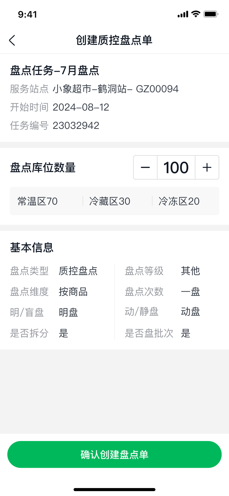

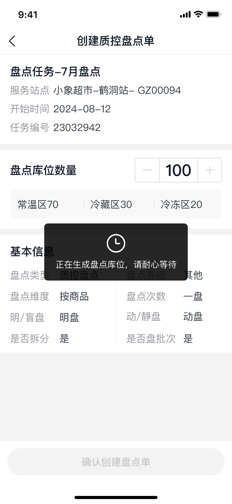

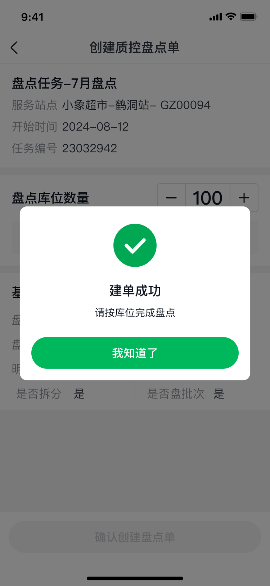

### 盘点单状态流转（多状态分析）

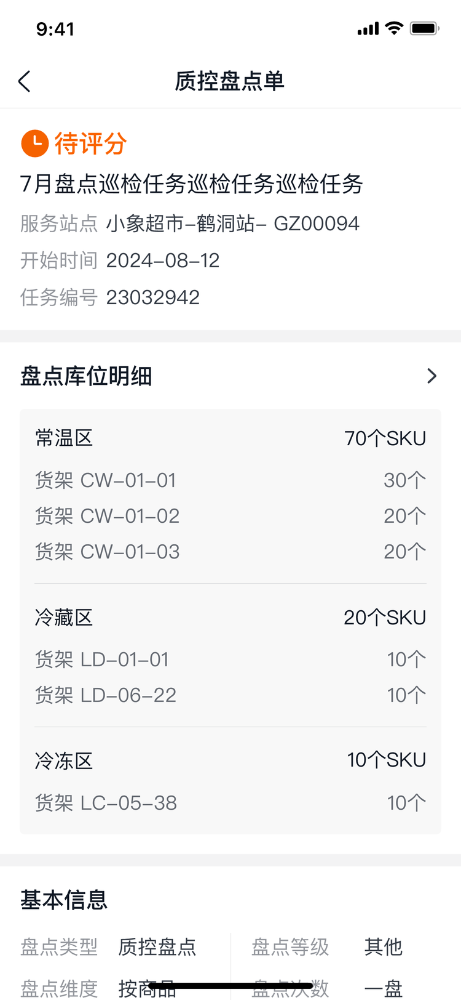

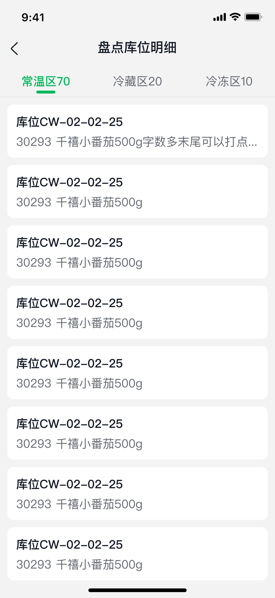

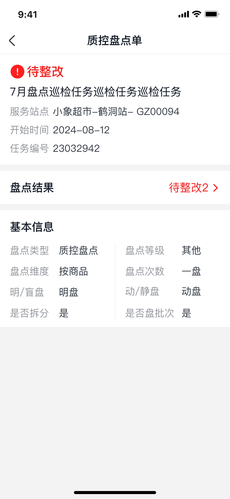

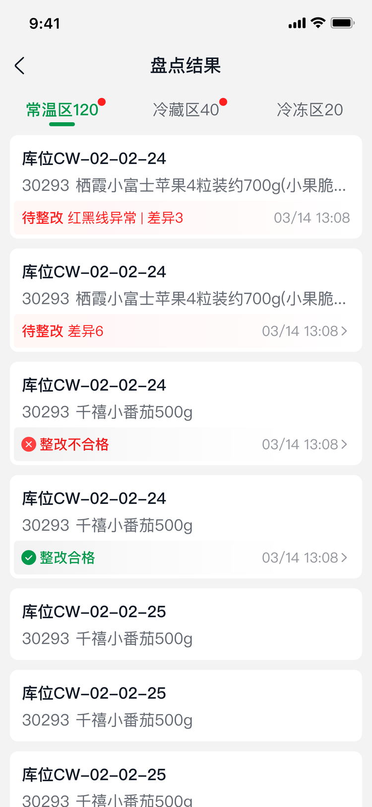

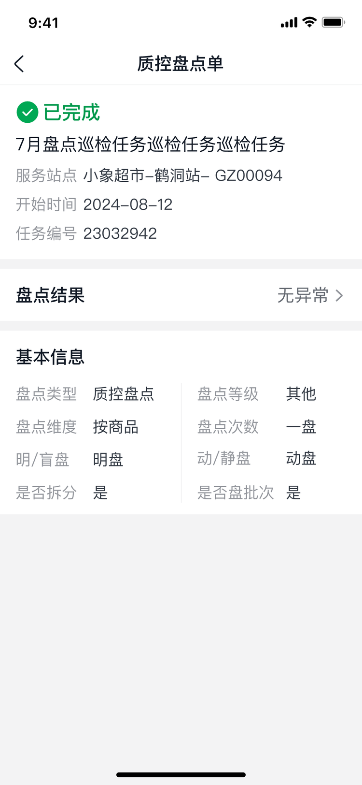

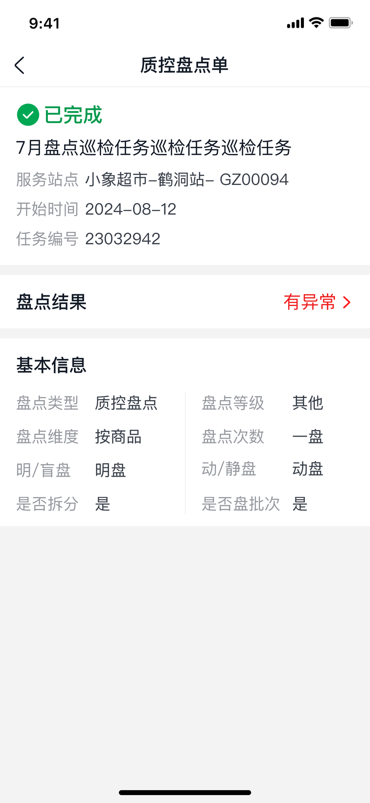

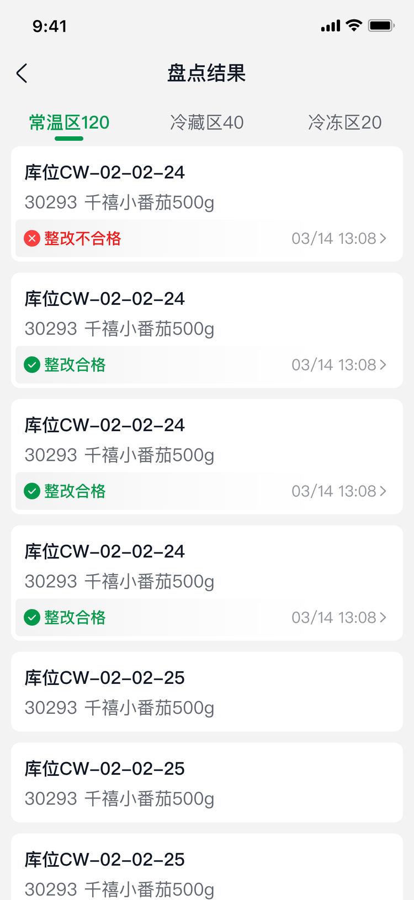

### 盘点记录

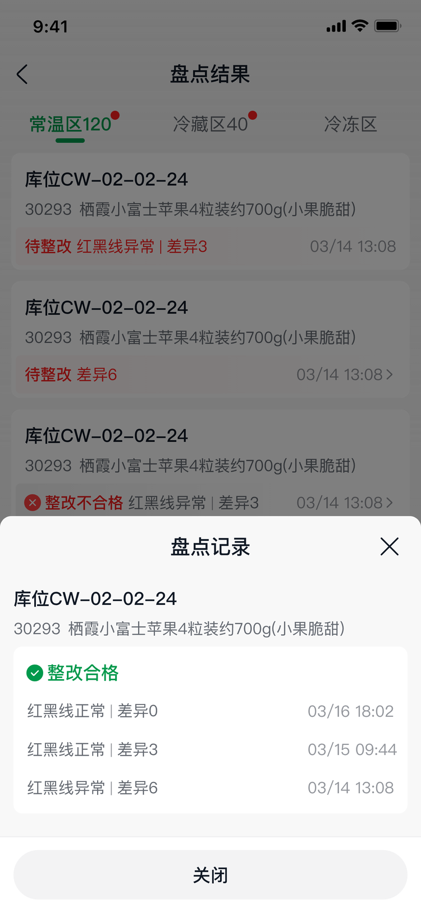

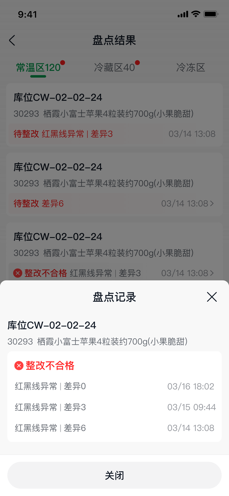

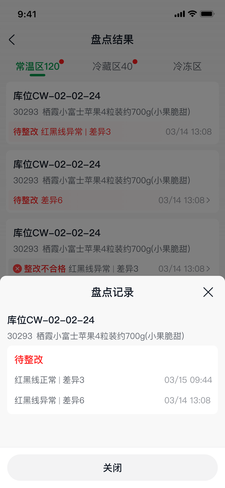
