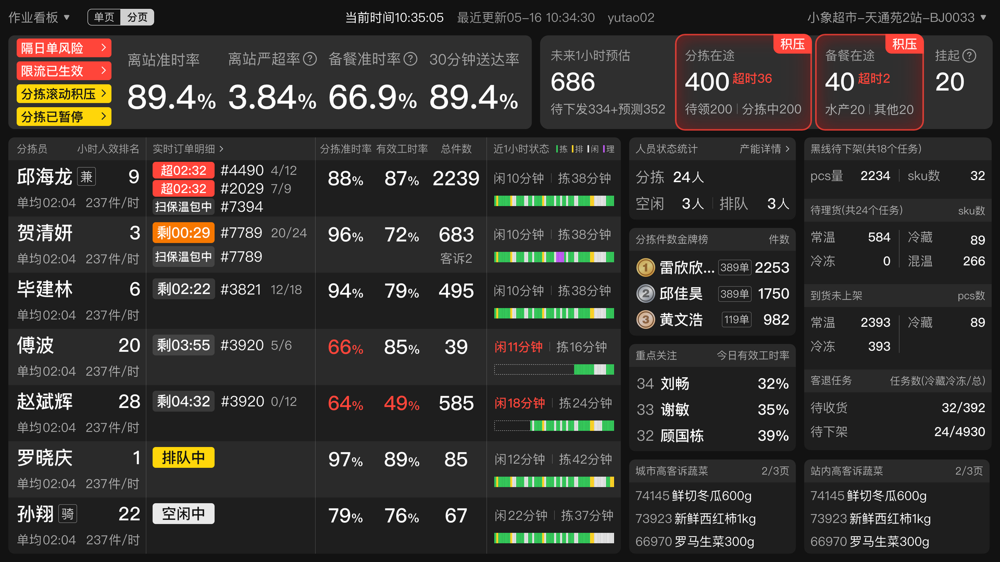

# 服务站电视看板迭代

> 来源文档：[【T3】服务站电视看板迭代](https://km.sankuai.com/collabpage/2381915675)
>
> **作品集突出要点：复杂信息设计**

---

## 一、项目概述

### 1. 从「设计三问」看项目

**1. 要做什么事？**

小象超市业务策略发生变化，需要优化服务站电视看板的信息展示，帮助服务站高效履约。

① 小象超市服务站以大站为趋势，对站长的管理效率有更高要求。

② 爆单时，分拣员的超时焦虑会大大提高出错率（导致客诉风险高），需要优化对分拣员考核指标。

考核指标优化对比：

| 考核指标·现状 | 考核指标·优化后 |
|--------------|----------------|
| 【指标】5分钟离店准时率（包括：用户下单→系统派单→分拣员开始分拣→分拣员结束分拣）| 【指标】分拣准时率（包括：分拣员开始分拣→分拣员结束分拣）|
| 【问题现状】从用户下单开始就计入分拣考核中，爆单时容易有连环超时，加重分拣员焦虑，使分拣积极性差。| 【优化策略】从分拣员开始分拣计算起，爆单时让分拣员不受连环超时干扰，保证分拣效率。|

**2. 体验目标：什么用户？解决什么问题？**

在信息密度增加后，站内人员仍能较高效浏览并指导行动：

- **站长视角：** 看清站内分拣员实时数据，及时做出调度和督促（从管订单转变为管人）。
- **分拣员视角：** 看清、看懂个人和他人数据的比较；爆单时，分拣工作不再受连环超时干扰。

**3. 要达到什么目标或收益？**

① 帮助站长高效管理，促进服务站履约指标提升。

② 激发分拣员竞争意识，促进服务站履约指标提升。

③ 缓解分拣员超时焦虑，降低由于分拣出错引起的客诉。

### 2. 设计衡量指标

| 类型 | 具体指标 | 衡量内容 |
|------|----------|----------|
| 间接 | 1. 离店准时率、离店严超率等站内履约指标大盘；2. 分拣准时率、因分拣出错导致的客诉率等分拣员考核指标 | 新版电视看板是否辅助**提升服务站履约效率** |
| 直接 | 站长/分拣员对电视看板的**费力度**评分 | 新版电视看板的**使用体验**如何 |

---

## 二、设计过程

### 1. 业务理解

设计过程：

- 让PM初步给出要展示的字段、示例、口径及其优先级。
- 前置参与业务会议，获取第一手信息。
- 用快速原型推动业务精简字段。

### 2. 字段精简

通过快速原型验证，与业务方协作精简展示字段，确保信息密度合理，不造成认知负担。

### 3. 布局选择

时间紧张且没有直接竞品参考时，找间接竞品提炼布局形式并快速与业务方确认方向。

### 4. 视觉调优

- 了解应用深色模式色彩原则，提升界面浏览舒适度。
- 通过字阶、参考线提升界面整体排版效果。

---

## 三、设计方案

改前 vs 改后对比：

- **改前：** 以订单为核心的信息展示，站长难以快速掌握人员状态。
- **改后：** 以人员为核心重构信息架构，站长可实时看到每位分拣员的数据，便于调度管理。

---

## 四、经验复盘

| 类型 | 经验 |
|------|------|
| 沟通协作 | 用快速原型推动业务精简字段；前置参与业务会议，获取第一手信息。 |
| UX设计 | 时间紧张且没有直接竞品参考时，找间接竞品提炼布局形式并快速与业务方确认方向；了解应用深色模式色彩原则，提升界面浏览舒适度；通过字阶、参考线提升界面整体排版效果。 |
