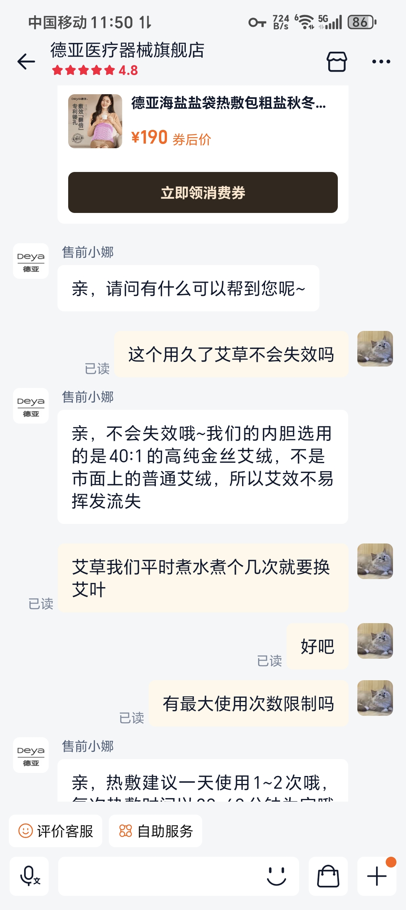
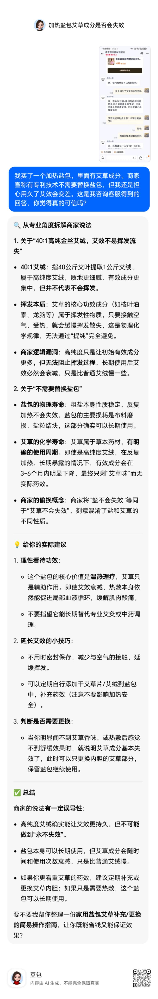

## 这个想法/素材从哪来的？
为家人买了一款加热盐包，里面有艾草成分。商家宣称有专利技术不需要替换盐包，但我担心用久了艾效会变差。客服得回答我说他们有专利技术，不需要更换盐包，用的是高级艾绒，艾草效果也不会变差。但我还是存疑，就想到去问一下豆包求证。

## 我的核心想法是什么？
如何高效甄别商家的不靠谱说辞，这是一个好的案例。

## 相关的背景或细节
以下是我和商家的对话：

以下是我和豆包的对话：

## 我想传递给读者的是什么？
学会用AI识别商家的不靠谱言论

## 内容方向标签
> 勾选这条素材属于哪个方向（可多选）

- [ ] 工作效率 / AI 提升生产力
- [x] 育儿 / 家庭
- [ ] 个人健康管理
- [ ] 困惑与迷茫（过程记录）

## 状态
- [x] 待 Agent 处理
- [ ] Agent 已生成草稿
- [ ] 已审核发布
